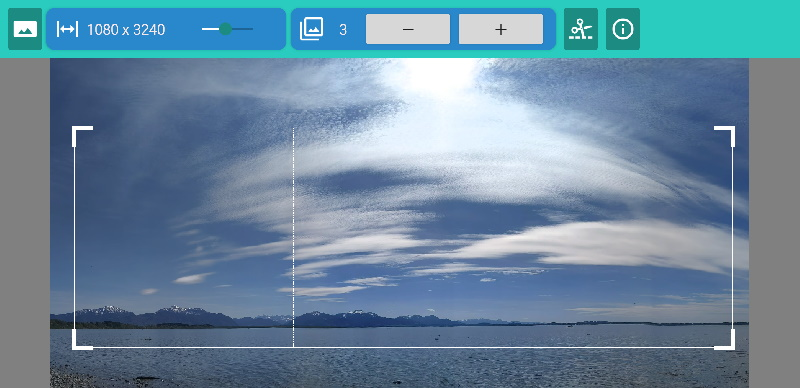

# Taglierina Panoramica

en: Tag is an app for cropping panoramas
it: Taglierina Panoramica è un'app per ritagliare panorami

## Development

Most of the code for cropping images was taken from the SkiaSharp examples
found here:

https://docs.microsoft.com/en-us/xamarin/xamarin-forms/user-interface/graphics/skiasharp/bitmaps/cropping

## License

The app is licensed using the [Apache License 2.0](LICENSE), the same license
as the Xamarin.Forms SkiaSharp examples. See also the
[Credits](src/Core/Credits.md) of the used libraries and resources.
